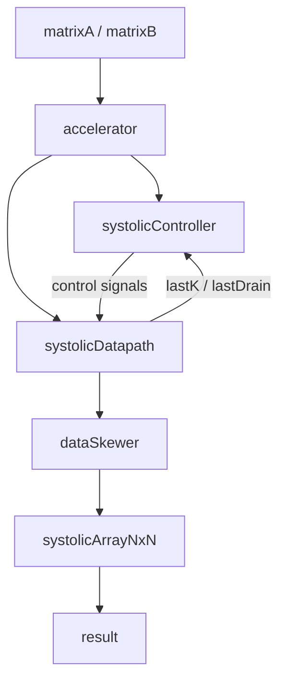
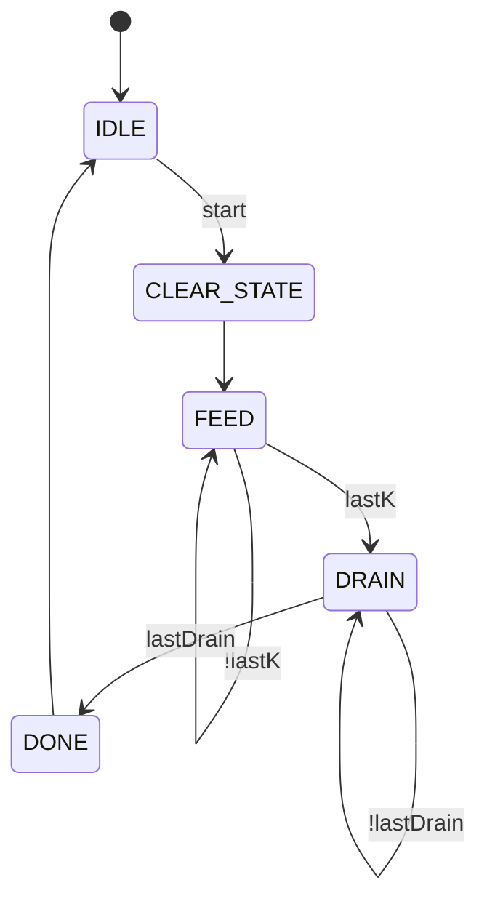

# FPGA Matrix Multiplication Accelerator

A SystemVerilog implementation of matrix multiplication using both a **single-MAC design** and a **parameterized systolic array**.

The project was built to compare a design that reuses one multiply-accumulate unit with a design that uses many processing elements (PEs) to perform calculations in parallel.

The current systolic accelerator supports square `N × N` matrices and can be configured for different matrix sizes using the parameter `N`.

---

## Matrix Multiplication

For matrices

$$
C = A \times B
$$

each output element is calculated as

$$
C_{ij} = \sum_{k=0}^{N-1} A_{ik}B_{kj}
$$

Matrix elements are 8-bit unsigned integers.

The systolic design uses an accumulator width of

$$
16 + \lceil \log_2(N) \rceil
$$

bits so that each PE can store the sum of `N` 8-bit × 8-bit products.

---

## Systolic Array Architecture

The main implementation is a parameterized `N × N` systolic array.

Each output element `C[i][j]` is calculated by one processing element. Each PE keeps its own running sum while A and B values move through the array.



---

## Top-Level Accelerator

`accelerator.sv` connects the controller and datapath.

### Inputs

- `clk`
- `reset`
- `start`
- `matrixA[N][N]`
- `matrixB[N][N]`

### Outputs

- `done`
- `result[N][N]`

The matrix size is controlled by:

```systemverilog
parameter int N = 4
```

The accumulator width is controlled by:

```systemverilog
parameter int sum_width = 16 + $clog2(N)
```

---

## Processing Element

The systolic array contains `N²` processing elements.

Each PE:

- Receives an A value from the left
- Receives a B value from above
- Adds `A × B` to its sum when both values are valid
- Stores its running sum locally
- Passes A to the PE on its right
- Passes B to the PE below
- Passes the valid signals along with the data

Each PE eventually produces one element of the output matrix.

---

## Systolic Array

`systolicArrayNxN.sv` creates the `N × N` grid of processing elements using nested SystemVerilog generate loops.

A values move horizontally through the array, while B values move vertically.


Each PE performs a multiply-accumulate operation only when both its A and B valid signals are high.

---

## Input Skewing

The A and B values cannot all enter the systolic array at the same time because values going to later rows and columns need to arrive later.

`dataSkewer.sv` delays each input lane based on its lane number:

- Lane 0: 0-cycle delay
- Lane 1: 1-cycle delay
- Lane 2: 2-cycle delay
- ...
- Lane `N-1`: `N-1` cycle delay

The same delay is applied to each lane's valid signal.

This makes sure the correct `A[i][k]` and `B[k][j]` values meet at each PE on the same clock cycle.

---

## Datapath

`systolicDatapath.sv` selects the matrix values that are sent into the systolic array.

During the `FEED` state:

```systemverilog
rawA[row] = matrixA[row][k];
rawB[col] = matrixB[k][col];
```

The `k` counter selects the next values needed for the matrix multiplication each cycle.

The selected values are sent through the data skewer and then into the systolic array.

After all `N` values of `k` have been sent into the array, the datapath waits for the remaining data to finish moving through the PEs.

The maximum number of drain cycles is:

$$
2N - 2
$$

---

## Controller

`systolicController.sv` uses a five-state FSM:



### `IDLE`

Waits for `start`.

### `CLEAR_STATE`

Clears the PE sums and resets the `k` and drain counters.

### `FEED`

Sends matrix values into the systolic array and moves through the values of `k`.

### `DRAIN`

Stops sending new matrix values and waits for the values already inside the array to finish moving through the PEs.

### `DONE`

Sets `done` high for one cycle before returning to `IDLE`.

---

## Single-MAC Baseline

The repository also includes a 4×4 matrix multiplier that uses one multiplier and one accumulator.

Instead of having many PEs working at the same time, this design reuses the same multiplier and accumulator for every output element.

Three counters track:

- Row `i`
- Column `j`
- Inner index `k`

Memory addresses are generated as:

$$
A[i][k] = 4i + k
$$

$$
B[k][j] = 4k + j
$$

$$
C[i][j] = 4i + j
$$

The controller uses five states:

```text
IDLE -> PREP -> CALCULATE -> WRITE -> DONE
```

The input matrices are stored in ROM and the completed results are written to RAM.

This design gives a simpler sequential version to compare against the systolic array.

---

## RISC-V Baseline Comparison

A future part of the project will compare the hardware accelerators against matrix multiplication running as software on a RISC-V processor.

The RISC-V processor will support hardware multiplication using the `M` extension.

The goal is to compare:

1. RISC-V software matrix multiplication
2. Single-MAC hardware accelerator
3. Systolic array accelerator

## RISC-V Baseline Comparison

A future part of the project will compare the hardware accelerators against matrix multiplication running on a RISC-V processor.

The goal is to compare:

1. RISC-V assembly matrix multiplication
2. Single-MAC hardware accelerator
3. Systolic array accelerator

### RISC-V Matrix Multiplication

Matrix multiplication will be implemented directly in RISC-V assembly.

The program will use nested loops to calculate each output element:

C[i][j] = A[i][0]B[0][j] + A[i][1]B[1][j] + ... + A[i][N-1]B[N-1][j]

The processor will perform the required loads, address calculations, multiplication, accumulation, loop control, and stores using normal RISC-V instructions.

The RISC-V processor will be extended with hardware multiply (`MUL`) support before performing the comparison.

### Comparison

The implementations can be compared using measurements such as:

- Total clock cycles for one matrix multiplication
- Time required to complete one matrix multiplication
- Number of multiply-accumulate operations completed per cycle
- How the designs scale as the matrix size increases

The purpose of the comparison is to see how the same matrix multiplication behaves when executed instruction-by-instruction on a processor, using one dedicated MAC unit, and using many processing elements in parallel.

## Verification

The design uses self-checking SystemVerilog testbenches.

If an output does not match the expected result, the testbench uses `$fatal` to stop the simulation and report the failure.

### Systolic Accelerator Tests

#### `accelerator2x2_tb.sv`

Tests the accelerator with:

```text
N = 2
```

and checks every element of the resulting 2×2 matrix.

#### `accelerator_tb.sv`

Tests the default:

```text
N = 4
```

configuration using several cases, including:

- Known matrix multiplication
- Different non-zero matrix values
- Maximum 8-bit values
- All-zero matrices
- Multiple calculations without resetting between them
- Multiplication by an identity matrix

#### `accelerator5x5_tb.sv`

Tests the same accelerator with:

```text
N = 5
```

and checks all 25 output elements.

This confirms that the design is not limited to only 4×4 matrices.

#### `acceleratorRandom_tb.sv`

Generates random matrix values and calculates the expected result inside the testbench.

Each accelerator output is then compared against the expected value.

Twenty randomized test cases are performed.

### Component-Level Verification

Additional testbenches check individual parts of the systolic design, including:

- Processing element
- Data skewer
- Systolic array

The single-MAC design also includes a self-checking 4×4 matrix multiplication testbench.

---

## Running the Simulation

From the `Systolic Array` directory, compile the main 4×4 accelerator testbench with Icarus Verilog:

```bash
iverilog -g2012 -o accelerator_tb accelerator_tb.sv accelerator.sv systolicController.sv systolicDatapath.sv dataSkewer.sv systolicArrayNxN.sv processingElement.sv
```

Run the simulation with:

```bash
vvp accelerator_tb
```

Other accelerator testbenches can be compiled by replacing `accelerator_tb.sv` with:

- `accelerator2x2_tb.sv`
- `accelerator5x5_tb.sv`
- `acceleratorRandom_tb.sv`

---

## Repository Structure

```text
FPGA-Matrix-Multiplication-Accelerator/
|
+-- Single MAC/
|   +-- controller.sv
|   +-- datapath.sv
|   +-- accumulator.sv
|   +-- multiplier.sv
|   +-- matrixCounter.sv
|   +-- ROMA.sv
|   +-- ROMB.sv
|   +-- RAMC.sv
|   +-- datapath_tb.sv
|
+-- Systolic Array/
    +-- accelerator.sv
    +-- systolicController.sv
    +-- systolicDatapath.sv
    +-- dataSkewer.sv
    +-- processingElement.sv
    +-- systolicArrayNxN.sv
    +-- accelerator_tb.sv
    +-- accelerator2x2_tb.sv
    +-- accelerator5x5_tb.sv
    +-- acceleratorRandom_tb.sv
    +-- component-level testbenches
```

---

## Tools

- SystemVerilog
- Icarus Verilog
- GTKWave
- Vivado

---

## Current Scope

Implemented:

- 4×4 single-MAC matrix multiplication accelerator
- Parameterized `N × N` systolic accelerator
- `N × N` grid of processing elements
- Input skewing
- Valid signals for controlling MAC operations
- Feed and drain controller states
- Multiple matrix multiplications using the same accelerator
- 2×2, 4×4, and 5×5 verification
- Self-checking testbenches
- Randomized testing

Planned:

- RISC-V software comparison
- FPGA synthesis and resource usage results
- Cycle-count comparison between the single-MAC and systolic designs
- Performance comparison between the RISC-V, single-MAC, and systolic implementations
