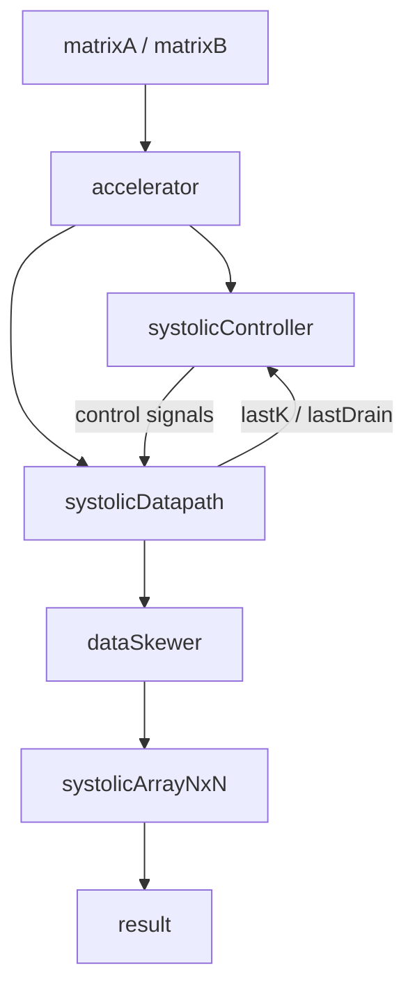
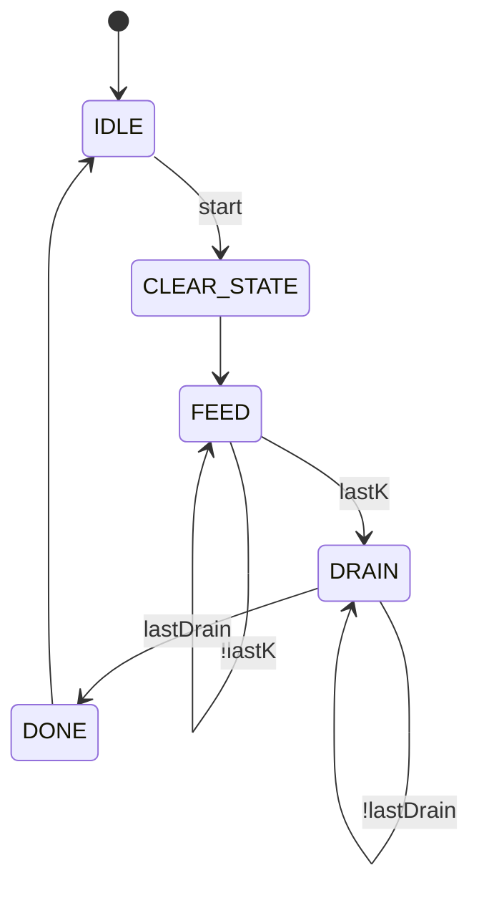

# FPGA Matrix Multiplication Accelerator

A SystemVerilog implementation of matrix multiplication using both a **parameterized single-MAC design** and a **parameterized systolic array**.

The project was built to compare a design that reuses one multiply-accumulate unit with a design that uses many processing elements (PEs) to perform calculations in parallel.

Both accelerators support square `N × N` matrices and can be configured for different matrix sizes using the parameter `N`.

---

## Matrix Multiplication

For matrices

$$
C = A \times B
$$

each output element is calculated as

$$
C_{ij} = \sum_{k=0}^{N-1} A_{ik}B_{kj}
$$

Matrix elements are 8-bit unsigned integers.

The accelerator designs use an accumulator width of

$$
16 + \lceil \log_2(N) \rceil
$$

bits so that the sum of `N` 8-bit × 8-bit products can be stored without overflow for the supported unsigned inputs.

---

## Systolic Array Architecture

The main implementation is a parameterized `N × N` output-stationary systolic array.

Each output element `C[i][j]` is calculated by one processing element. Each PE keeps its own running sum while A and B values move through the array.


```mermaid
flowchart TD
    INPUT["matrixA / matrixB"] --> ACC["accelerator"]

    ACC --> CTRL["systolicController"]
    ACC --> DP["systolicDatapath"]

    CTRL -->|"control signals"| DP
    DP -->|"lastK / lastDrain"| CTRL

    DP --> SK["dataSkewer"]
    SK --> ARRAY["systolicArrayNxN"]
    ARRAY --> RESULT["result"]
```

---

## Top-Level Accelerator

`accelerator.sv` connects the controller and datapath.

### Inputs

- `clk`
- `reset`
- `start`
- `matrixA[N][N]`
- `matrixB[N][N]`

### Outputs

- `done`
- `result[N][N]`

The matrix size is controlled by:

```systemverilog
parameter int N = 4
```

The accumulator width is controlled by:

```systemverilog
parameter int sum_width = 16 + $clog2(N)
```

---

## Processing Element

The systolic array contains `N²` processing elements.

Each PE:

- Receives an A value from the left
- Receives a B value from above
- Adds `A × B` to its sum when both values are valid
- Stores its running sum locally
- Passes A to the PE on its right
- Passes B to the PE below
- Passes the valid signals along with the data

Each PE eventually produces one element of the output matrix.

Because each output value remains in its assigned PE while being accumulated, the array uses an **output-stationary** dataflow.

---

## Systolic Array

`systolicArrayNxN.sv` creates the `N × N` grid of processing elements using nested SystemVerilog generate loops.

A values move horizontally through the array, while B values move vertically.


Each PE performs a multiply-accumulate operation only when both its A and B valid signals are high.

---

## Input Skewing

The A and B values cannot all enter the systolic array at the same time because values going to later rows and columns need to arrive later.

`dataSkewer.sv` delays each input lane based on its lane number:

- Lane 0: 0-cycle delay
- Lane 1: 1-cycle delay
- Lane 2: 2-cycle delay
- ...
- Lane `N-1`: `N-1` cycle delay

The same delay is applied to each lane's valid signal.

This makes sure the correct `A[i][k]` and `B[k][j]` values meet at each PE on the same clock cycle.

---

## Datapath

`systolicDatapath.sv` selects the matrix values that are sent into the systolic array.

During the `FEED` state:

```systemverilog
rawA[row] = matrixA[row][k];
rawB[col] = matrixB[k][col];
```

The `k` counter selects the next values needed for the matrix multiplication each cycle.

The selected values are sent through the data skewer and then into the systolic array.

After all `N` values of `k` have been sent into the array, the datapath waits for the remaining data to finish moving through the PEs.

The maximum number of drain cycles is:

$$
2N - 2
$$

---

## Controller

`systolicController.sv` uses a five-state FSM:


```mermaid
stateDiagram-v2
    [*] --> IDLE
    IDLE --> CLEAR_STATE: start
    CLEAR_STATE --> FEED
    FEED --> DRAIN: lastK
    FEED --> FEED: !lastK
    DRAIN --> DONE: lastDrain
    DRAIN --> DRAIN: !lastDrain
    DONE --> IDLE
```

### `IDLE`

Waits for `start`.

### `CLEAR_STATE`

Clears the PE sums and resets the `k` and drain counters.

### `FEED`

Sends matrix values into the systolic array and moves through the values of `k`.

### `DRAIN`

Stops sending new matrix values and waits for the values already inside the array to finish moving through the PEs.

### `DONE`

Sets `done` high for one cycle before returning to `IDLE`.

---

## Single-MAC Baseline

The repository also includes a parameterized `N × N` matrix multiplier that uses one multiplier and one accumulator.

Instead of having many PEs working at the same time, this design reuses the same multiplier and accumulator for every output element.

Three counters track:

- Row `i`
- Column `j`
- Inner index `k`

Memory addresses are generated as:

$$
A[i][k] = iN + k
$$

$$
B[k][j] = kN + j
$$

$$
C[i][j] = iN + j
$$

The matrix size and accumulator width are parameterized using:

```systemverilog
parameter int N = 4
parameter int SUM_WIDTH = 16 + $clog2(N)
```

The controller uses five states:

```text
IDLE -> PREP -> CALCULATE -> WRITE -> DONE
```

The input matrices are stored in the `RAMA` and `RAMB` arrays and completed output elements are written to `RAMC`.

This design gives a simpler sequential version to compare against the parallel systolic array.

---

## RISC-V Baseline Comparison

The hardware accelerators were compared against matrix multiplication running in RISC-V assembly on a separate 32-bit five-stage pipelined RISC-V processor.

The processor supports a subset of RV32I plus the `MUL` instruction from the RISC-V M extension.

### RISC-V Matrix Multiplication

Matrix multiplication is implemented directly in RISC-V assembly.

The program uses nested loops to calculate each output element:

```text
C[i][j] = A[i][0]B[0][j] + A[i][1]B[1][j] + ... + A[i][N-1]B[N-1][j]
```

The processor performs the required loads, address calculations, multiplication, accumulation, loop control, and stores using RISC-V instructions.

2×2, 4×4, and 8×8 matrix multiplication benchmarks were run on the RISC-V CPU, single-MAC accelerator, and systolic accelerator.

---

## Performance Comparison

The three architectures were compared using:

- Total clock cycles
- Post-implementation maximum clock frequency
- Execution time
- LUT and flip-flop usage
- Execution-time speedup

Execution time was calculated using:

$$
T_{execution} = \frac{\text{Cycles}}{F_{max}}
$$

Speedup between two implementations was calculated using:

$$
\text{Speedup} =
\frac{T_{\text{baseline}}}{T_{\text{accelerated}}}
$$

### Benchmark Results

| Architecture | N | Cycles | Fmax (MHz) | LUTs | FFs | Execution Time (µs) |
|---:|---:|---:|---:|---:|---:|---:|
| RISC-V CPU | 2 | 163 | 58 | 554 | 423 | 2.8103 |
| RISC-V CPU | 4 | 969 | 58 | 554 | 423 | 16.7069 |
| RISC-V CPU | 8 | 6913 | 58 | 554 | 423 | 119.1897 |
| Single MAC | 2 | 16 | 165 | 66 | 27 | 0.0970 |
| Single MAC | 4 | 96 | 165 | 66 | 27 | 0.5818 |
| Single MAC | 8 | 640 | 165 | 66 | 27 |3.8788 |
| Systolic Array | 2 | 6 | 406 | 43 | 74 |0.0148 |
| Systolic Array | 4 | 12 | 184 | 278 | 283 |0.0652 |
| Systolic Array | 8 | 24 | 152 | 2141 | 1053 | 0.1579 |

### Execution-Time Speedup

| Matrix Size | CPU vs Single MAC | CPU vs Systolic | Single MAC vs Systolic |
|---|---:|---:|---:|
| 2×2 | 28.98× | 190.17× | 6.56× |
| 4×4 | 28.71× | 256.17× | 8.92× |
| 8×8 | 30.73× | 754.87× | 24.57× |

### Results

The RISC-V CPU uses the same processor hardware for all three matrix sizes, but the number of cycles increases as the amount of matrix multiplication work increases. The measured cycle count increased from 163 cycles for 2×2 to 6913 cycles for 8×8.

The single-MAC accelerator also reuses the same arithmetic hardware for each matrix size. Its LUT and flip-flop usage remained the same in the tested implementations, while its cycle count increased from 16 cycles for 2×2 to 640 cycles for 8×8.

The systolic array uses additional hardware as `N` increases because a larger array contains more processing elements. This can be seen in the LUT and flip-flop counts, which increase substantially between the 2×2 and 8×8 implementations.

In exchange for the additional hardware, the systolic array requires far fewer cycles. The measured cycle counts were 6 cycles for 2×2, 12 cycles for 4×4, and 24 cycles for 8×8.

The systolic array's measured Fmax decreased from 406 MHz for the 2×2 implementation to 152 MHz for the 8×8 implementation. Despite the lower clock frequency, the reduced cycle count still gave the systolic array the lowest execution time in every tested configuration.

For the 8×8 benchmark, the systolic array completed matrix multiplication in **24 cycles at 152 MHz**, corresponding to an execution time of approximately **158 ns**. This was approximately **755× faster than the RISC-V CPU** and **24.6× faster than the single-MAC accelerator**.

---

## Verification

The design uses self-checking SystemVerilog testbenches.

If an output does not match the expected result, the testbench uses `$fatal` to stop the simulation and report the failure.

### Systolic Accelerator Tests

#### `accelerator2x2_tb.sv`

Tests the accelerator with:

```text
N = 2
```

and checks every element of the resulting 2×2 matrix.

#### `accelerator_tb.sv`

Tests the default:

```text
N = 4
```

configuration using several cases, including:

- Known matrix multiplication
- Different non-zero matrix values
- Maximum 8-bit values
- All-zero matrices
- Multiple calculations without resetting between them
- Multiplication by an identity matrix

#### `accelerator5x5_tb.sv`

Tests the same accelerator with:

```text
N = 5
```

and checks all 25 output elements.

This confirms that the design is not limited to only 4×4 matrices.

#### `acceleratorRandom_tb.sv`

Generates random matrix values and calculates the expected result inside the testbench.

Each accelerator output is then compared against the expected value.

Twenty randomized test cases are performed.

### Systolic Benchmark Tests

Additional benchmark testbenches measure the cycle count of the systolic accelerator for the same matrix sizes used by the RISC-V and single-MAC benchmarks.

Measured results:

| Matrix Size | Cycles |
|---|---:|
| 2×2 | 6 |
| 4×4 | 12 |
| 8×8 | 24 |

Each benchmark checks every output element before reporting the cycle count.

### Single-MAC Benchmark Tests

The parameterized single-MAC accelerator includes self-checking benchmark testbenches for:

- `singleMacBenchmark2x2_tb.sv`
- `singleMacBenchmark4x4_tb.sv`
- `singleMacBenchmark8x8_tb.sv`

Measured results:

| Matrix Size | Cycles |
|---|---:|
| 2×2 | 16 |
| 4×4 | 96 |
| 8×8 | 640 |

Each benchmark checks every output element stored in `RAMC` before reporting the cycle count.

### RISC-V Benchmark Tests

The RISC-V processor includes equivalent matrix multiplication benchmarks for:

- 2×2
- 4×4
- 8×8

Measured results:

| Matrix Size | Cycles |
|---|---:|
| 2×2 | 163 |
| 4×4 | 969 |
| 8×8 | 6913 |

The benchmark programs perform matrix multiplication using RISC-V assembly and use hardware `MUL` instructions for multiplication.

### Component-Level Verification

Additional testbenches check individual parts of the systolic design, including:

- Processing element
- Data skewer
- Systolic array
- Systolic datapath

The single-MAC design also includes datapath-level verification in addition to the 2×2, 4×4, and 8×8 benchmark testbenches.

---

## FPGA Implementation

The single-MAC and systolic designs were synthesized and implemented in Vivado for the Digilent Basys 3 FPGA using the Artix-7 XC7A35T device.

Post-implementation timing analysis was used to determine the maximum tested clock frequency for each 2×2, 4×4, and 8×8 configuration.

The implementations were also characterized using LUT and flip-flop utilization from the Vivado implementation reports.

These measurements were combined with the simulated cycle counts to calculate execution time for each architecture and matrix size.

---

## Running the Simulation

From the `Systolic Array` directory, compile the main 4×4 accelerator testbench with Icarus Verilog:

```bash
iverilog -g2012 -o accelerator_tb accelerator_tb.sv accelerator.sv systolicController.sv systolicDatapath.sv dataSkewer.sv systolicArrayNxN.sv processingElement.sv
```

Run the simulation with:

```bash
vvp accelerator_tb
```

Other systolic testbenches can be compiled by replacing `accelerator_tb.sv` with the desired testbench.

For example, the 8×8 benchmark uses:

```bash
iverilog -g2012 -s systolicBenchmark8x8_tb -o systolicBenchmark8x8_tb systolicBenchmark8x8_tb.sv accelerator.sv systolicController.sv systolicDatapath.sv dataSkewer.sv systolicArrayNxN.sv processingElement.sv
```

Run with:

```bash
vvp systolicBenchmark8x8_tb
```

From the `Single MAC` directory, compile the 4×4 benchmark with:

```bash
iverilog -g2012 -s singleMacBenchmark4x4_tb -o singleMacBenchmark4x4_tb singleMacBenchmark4x4_tb.sv accumulator.sv controller.sv datapath.sv matrixCounter.sv multiplier.sv RAMA.sv RAMB.sv RAMC.sv
```

Run with:

```bash
vvp singleMacBenchmark4x4_tb
```

The corresponding 2×2 and 8×8 benchmark testbenches can be run in the same way.

---

## Tools

- SystemVerilog
- Icarus Verilog
- GTKWave
- Vivado
- Digilent Basys 3

---

## Current Scope

Implemented:

- Parameterized `N × N` single-MAC matrix multiplication accelerator
- Parameterized `N × N` output-stationary systolic accelerator
- `N × N` grid of processing elements
- Input skewing
- Valid signals for controlling MAC operations
- Feed and drain controller states
- Multiple matrix multiplications using the same accelerator
- 2×2, 4×4, and 5×5 systolic verification
- Randomized systolic verification
- 2×2, 4×4, and 8×8 benchmark testbenches
- Parameterized single-MAC benchmark testing
- RISC-V assembly matrix multiplication baseline
- RISC-V hardware `MUL` support
- FPGA synthesis and implementation
- Post-implementation Fmax measurements
- LUT and flip-flop utilization measurements
- Cycle-count comparison between all three architectures
- Execution-time comparison between all three architectures
- Execution-time speedup comparison
- Self-checking SystemVerilog testbenches
